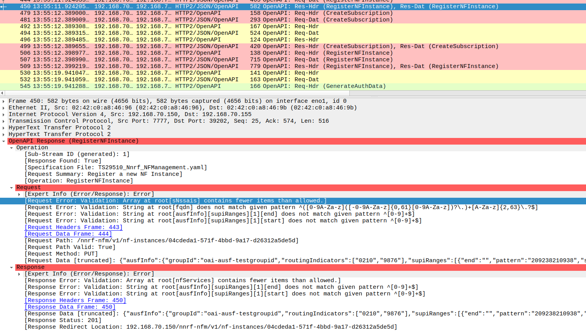

# OpenAPI Dissector

This repository contains experimental code for generating an OpenAPI dissector for use within Wireshark.

It was mainly developed for analyzing traffic in 5G core networks, which sends JSON messages over a HTTP2 API,
but it could potentially be adapted for other APIs as well.



## Features

- Shows information about operations (summary and filename of specification)
- Validates most of the basic OpenAPI aspects
    - Object properties
    - Simple data types (including value ranges and patterns)
    - Arrays with or without defined item properties
    - etc.
- Supports resolving of specification references (including recursively nested data types)
- Basic support for complex OpenAPI features
    - Support for `anyOf`/`allOf`/`oneOf` keywords, including basic discriminator support
    - Basic support for the `not` keyword (currently only supports forbidden object properties)
    - Reporting incorrectly sent fields which were marked readOnly/writeOnly
- Initial support for callback handling (very limited)
- Links relevant packets inside of the packet details
    - Operations request/response header and data
    - Link between callbacks and source of callback registration (e.g. nnrf subscription and status notifications)
- Highlights packets with found errors inside of Wiresharks packet list
- Prints found errors in packet details

## Installation

### Generate spec file

First you'll need to generate a spec file, this can be done using a few commands:

```bash
cd generator/
git clone -b REL-17 https://forge.3gpp.org/rep/all/5G_APIs 5GC_APIs
python3 generate.py
```

`gererate.py` processes the 3GPP release specific OpenAPI yaml files which have to be copied into the `5GC_APIs` sub-directory and as a result the `openapi_spec.lua` is created in the generator directory.

### Download json library

The dissector code uses a simple JSON library for Lua that can be found [here](https://github.com/rxi/json.lua).

Download the json.lua contained in that repository.

For security reasons we recommend validating the sha256 checksum of the downloaded file, which as of writing this
documentation (2023-07-26) should be `0eaccda57fabc0330736de25f45cf589821a42b5e0fe02e4e3125f7dc0bf2b7e`.

### Copy required files to wiresharks plugin directory

Inside of Wireshark click on `Help` in the menu bar, and select `About Wireshark`.
In the newly opened window click on the tab `Folders` and look for the entry `Personal Lua Plugins`.

Copy the following files into that directory:

- `openapi_spec.lua` (as generated earlier)
- `json.lua` (as downloaded from the linked project)
- `openapi.lua`
- `json_validator.lua`

## Usage

On launching a new Wireshark instance the plugin should be automatically loaded. Or select in Wireshark the button Analyze->Reload Lua Plugins.

The dissector attaches itself as postdissector to all HTTP2 packets, so no further configuration is needed as of now.

Now you can apply `openapi` as display filter for Wireshark. 

## Limitations

- Only basic validation of URL parts and no validation for URL query arguments
- Supports only HTTP2 for now (primary use case was analyzing 5G traffic, which mainly uses HTTP2 for communication)
- Incomplete support for anyOf/allOf/oneOf/not keywords (because of undefined behaviour in spec)
- Issues with multiple HTTP2 messages inside a single TCP packet
- No support for predefined data types (e.g. email, uuid, ...)
- Handling of callbacks needs a lot of work, current implementation lacks handling of most of the possible target locations
- Since this is currently a postdissector it can only run on a second pass, which does not happen during Wiresharks live capture mode
- Better error handling (some operations fail silently in Wiresharks Lua environment..)

There are probably a lot more limitations, but as least some of those limitations are due to undefined behaviour
or even conflicts between the OpenAPI and JSON Schema specification. For some of those cases the best way would
probably be to read code of other OpenAPI related projects and implement the behaviour accordingly, but since this
projects exists in the 5G ecosystem we'll probably end up matching the behaviour to align with the 5G specification.

Currently there is also a bug where sometimes the dissector just doesn't do anything.
This can be worked around by simply reloading the Lua scripts (Ctrl+Shift+L).

## Future improvements

- All of the current limitations should obviously be improved
- Improve handling of missing HTTP2 header fields (due to compression in http2 combined with eventually missing packets in pcap)
- Implementing HTTP/1.x support
- Support JSON data inside of multipart containers
- Easy filtering on data inside of OpenAPI packets (currently only possible using a regex workaround)
- Multi-Version support (5G core networks sometimes use a mix of different API releases, we may need support for this)
- Manual selection of correct operation on potential mismatch
- Implement some logic to match specification documents to the correct services (should improve both speed and overall detection of used operations)

At least some of those improvements may need implementation of GUI elements or even a C-extension for wireshark.

## License

Copyright (c) 2023 Deutsche Telekom AG.

Licensed under the GNU General Public License Version 2.0 (or later) (the "License"); you may not use this file except in compliance with the License.

You may obtain a copy of the License by reviewing the file [LICENSE](./LICENSE) in the repository or by downloading the respective version from
https://www.gnu.org/licenses/

Unless required by applicable law or agreed to in writing, software distributed under the License is distributed on an "AS IS" BASIS, WITHOUT WARRANTIES OR CONDITIONS OF ANY KIND, either express or implied. See the [LICENSE](./LICENSE) for the specific language governing permissions and limitations under the License.
